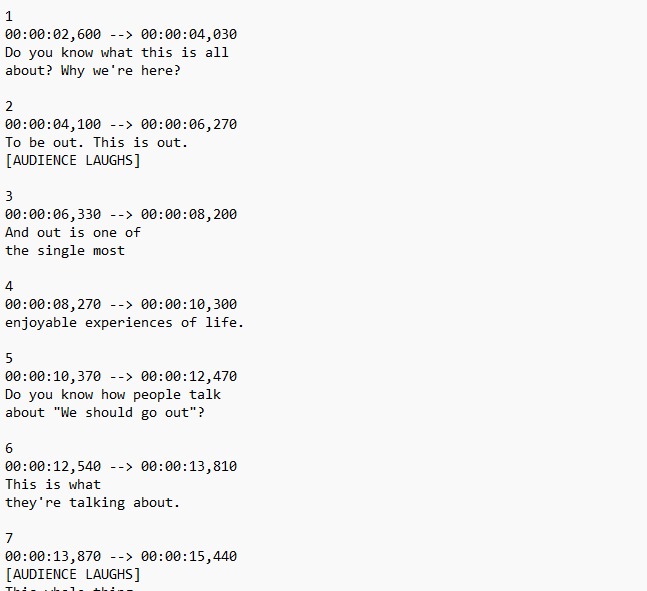
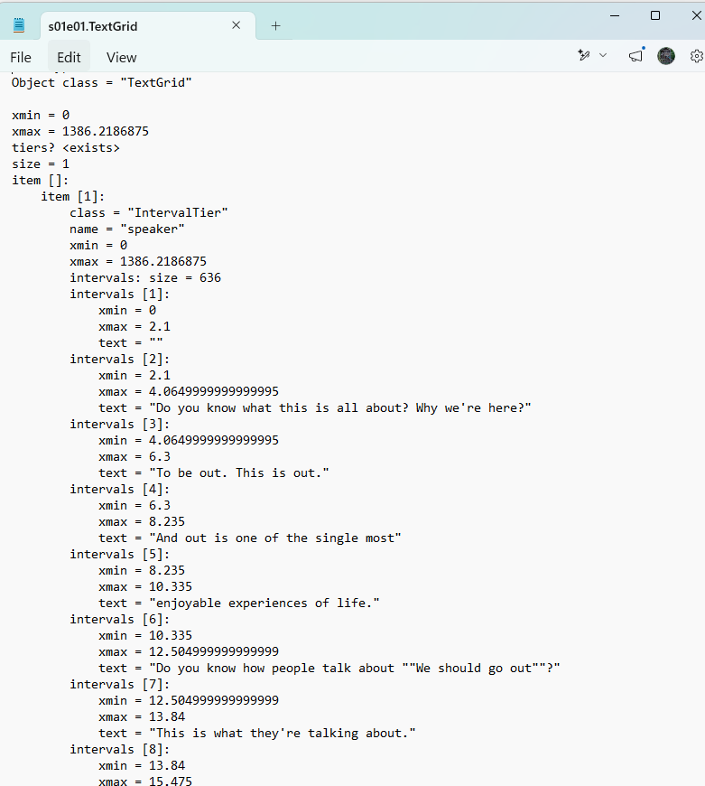
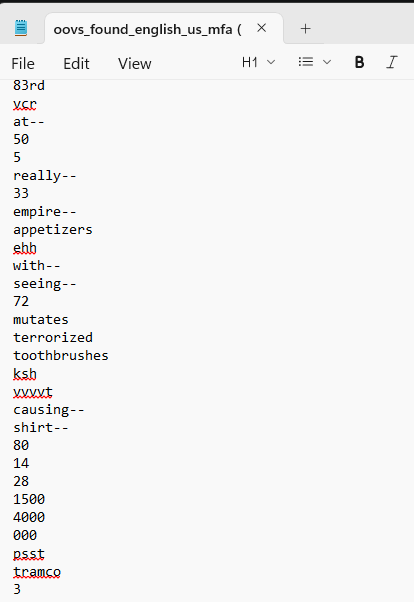
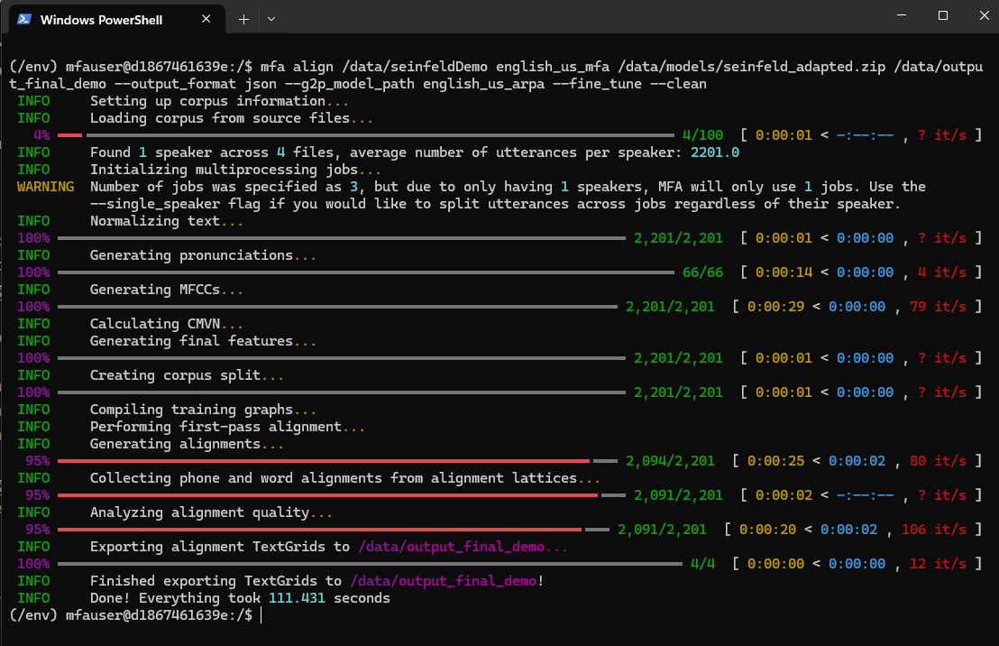
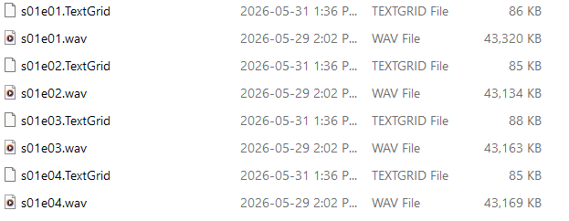
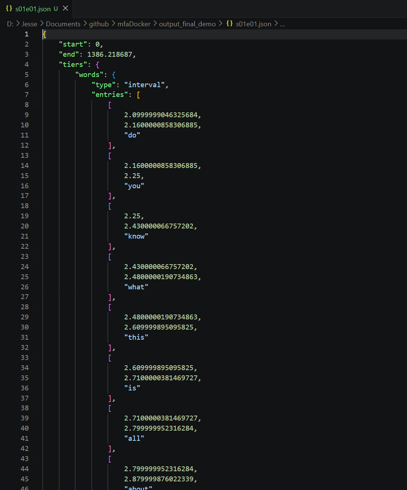

torrented seinfeld all 9 seasons

use python scripts to
renamed episodes to be s##e##

extracted audio from each episode as a .wav file

extracted subtitle text from each episode as a .srt file

then from each srt file only the text was extracted and placed into a txt file for each episode, along with removing text which was not spoken words
such as [audience laughter] and a bunch of other stuff enclosed in square brackets

set up montreal forced aligner docker image
https://montreal-forced-aligner.readthedocs.io/en/latest/first_steps/index.html

after installing docker and getting the montreal forced aligner docker image
https://montreal-forced-aligner.readthedocs.io/en/latest/installation.html

docker run -it -v D:\Jesse\Documents\github\mfaDocker:/data mmcauliffe/montreal-forced-aligner:latest
this creates the docker with this directory as the folder "data" in the docker.
from there I can run mfa commands

I kept a file with all the commands I was running because I would realize something was wrong and have to restart a few times

#download models:
mfa model download acoustic english_mfa

mfa model download dictionary english_us_mfa

#this one is for words that aren't in the english dictionary, generates pronounciations for them
mfa model download g2p english_us_arpa

#original command attempt
mfa align /data english_us_mfa english_mfa /data/output --output_format json

this originally kind of failed and I realized the 23 minute wavs with the blocks of text weren't working that well.
thankfully mfa can also use textgrids, which I could use the subtitle timing info for

they look like this

#then went on to mess around with the mfa docker more 
#honestly still not 100% sure what validate does, but it did output some interesting information about words that weren't compatible for being aligned and led me to start using 
#the g2p english_us_arpa model to help
mfa validate /data/Seinfeld/Season1 english_us_mfa english_mfa --output_directory /data/output --output_format json --g2p_model_path english_us_arpa --clean
around this point I realized from one of the output files from validate that a bunch of words weren't working since they werent in the english_us_mfa dictionary, this included words
with dashes but also included numbers which were given as actual numbers like 25 not twenty five and therefore didnt work with the model

thankfully there is a numbers to words python library that I was able to use to help with this, didnt get everything but helped a lot.

also discovered in the mfa docs you can fine tune the model on your set of words

mfa adapt /data/Seinfeld/allWavAndTG english_us_mfa english_mfa /data/models/seinfeld_adapted.zip --output_directory /data/output_adapted --output_format json --fine_tune --clean

and then finally used this command to run on all episode .wav and .textgrid files, i dont have the terminal session from this run open anymore but below ill show a demo run on 4 episodes and the output
mfa align /data/Seinfeld/allWavAndTG english_us_mfa /data/models/seinfeld_adapted.zip /data/output_final --output_format json --g2p_model_path english_us_arpa --fine_tune --clean

the seinfeldDemo folder contained these files

and then a json file like this for every .wav and .textgrid I had (one for each episode)

this last mfa align command also output a alignment_analysis.csv file which by blank or populated rows showed me how many words had been successfully aligned acorss the whole show,
apparently around 94 percent

I then started working on python program which would go though all the alignment info json files and get all the aligned words available. Then a simple ui
with a text input bar that would show/autocomplete available words below as you typed, and hitting enter would add them to a list of words, from which you could 
build a video with those words in order, thankfully there ffmpeg has a python api to help with this! At this point I realized although 94% were "successfully aligned" a lot of words,
especially ones that are spoken quickly and fall in the middle of sentences dont cut out well, there were also many cases where alignment wasn't perfect

alignment_analysis.csv had some other stats but after checking them out they didnt really give a good look at how clear a cut word was

To try to sort the good cuts from the bad ones I used a wav2vec2 model (a speech recognition model from facebook/meta) to score each aligned word.
the idea was to take the audio slice MFA said was e.g. "hello", feed it to wav2vec2, and see how confidently the model decoded that same word back. high confidence meant
the audio was clean and the alignment was probably accurate; low confidence meant something was off — the word was mumbled, cut weirdly, or the timing was slightly wrong.
this gave me a per-word confidence score I could use to filter candidates, keeping only the cleaner-sounding ones and setting a minimum quality bar before a word would
ever end up in a generated video.

that helped a lot with word quality but it still left a problem: single words are often not enough to make a coherent sentence, and they can sound awkward on their own.
so I extended the approach to n-grams — contiguous sequences of 1 to 6 words within a single subtitle line. rather than just scoring words, I now score every phrase window
within each line, so "not that there's anything wrong with that" can be matched and cut as a single unit rather than stitched together from six separate word clips.
this meant the sentence builder could now pick longer, naturally-flowing phrases from the show, which made the output much less robotic.

at this point I started thinking about putting it on the web, and ran into a pretty immediate problem: each episode's wav file is around 40–60 MB, and the mkv is larger still.
having the browser download a whole episode just to play a 2-second clip is not really viable. I needed to pre-cut the audio into smaller pieces.

the solution was to shift the whole pipeline to work on subtitle lines rather than full episodes. instead of storing timing info relative to the episode start, I cut each
subtitle line out as its own short mp4 clip with karaoke-style word-highlight captions burned in, then stored the clip's start and end times relative to the beginning of
that line file. I ended up with a flat folder of thousands of short clips and an inverted index mapping each candidate n-gram to every clip it appears in, along with
the in-clip timestamps for trimming. the web build loads the index, picks the best clip for each phrase the user typed, trims it client-side using ffmpeg.wasm (ffmpeg
compiled to webassembly so it runs in the browser), and stitches the pieces together — no server-side processing needed.

to actually host it I uploaded all the line clips to a Digital Ocean Spaces bucket (essentially S3-compatible object storage) and deployed the web frontend to a Digital Ocean
droplet. the frontend is a static page — seinfeldPhraseGenerator.html — that loads the clip index from the CDN and does all the video assembly in the browser.

then a lot of testing. the ffmpeg.wasm pipeline in particular took a while to get right — clip trimming, audio sync, making sure clips concatenated cleanly, handling
CORS correctly between the droplet and the Spaces CDN. there were a lot of edge cases.

added a retro Seinfeld-themed UI with some funky themes because if you're going to make a Seinfeld phrase generator it should at least look the part.

and then finally sent some deeply unhinged shitpost videos to people to make sure it all worked end to end.